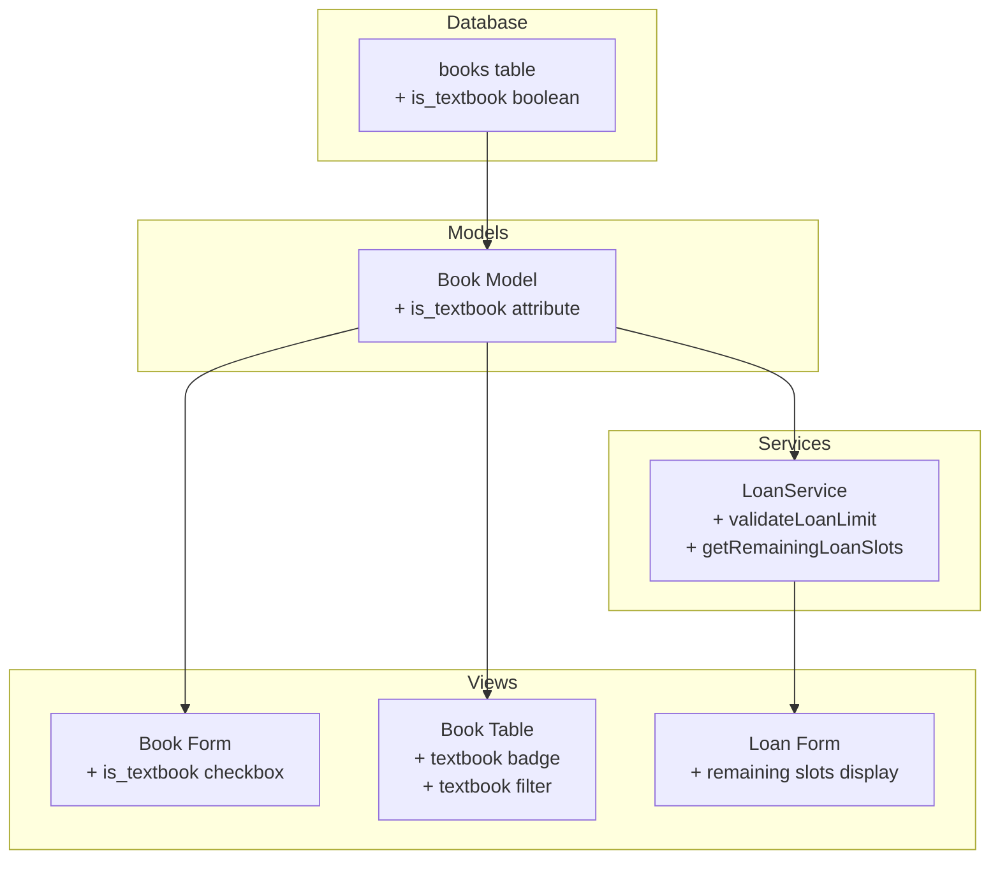

# Design Document: Textbook Flag Feature

## Overview

Fitur ini menambahkan kemampuan untuk menandai buku sebagai "Buku Paket Pelajaran" (textbook) dalam sistem perpustakaan sekolah. Implementasi melibatkan perubahan pada database schema, model Book, form input buku, logika peminjaman di LoanService, dan tampilan tabel buku.

Perubahan utama:
1. Menambahkan kolom `is_textbook` pada tabel `books`
2. Memodifikasi form input/edit buku untuk menampilkan checkbox
3. Memodifikasi LoanService untuk mengecualikan buku paket dari perhitungan batas peminjaman
4. Menambahkan badge dan filter pada tabel buku

## Architecture



## Components and Interfaces

### 1. Database Migration

Menambahkan kolom `is_textbook` pada tabel `books`:

```php
Schema::table('books', function (Blueprint $table) {
    $table->boolean('is_textbook')->default(false)->after('price');
});
```

### 2. Book Model

Menambahkan `is_textbook` ke `$fillable` dan `$casts`:

```php
protected $fillable = [
    // ... existing fields
    'is_textbook',
];

protected $casts = [
    // ... existing casts
    'is_textbook' => 'boolean',
];
```

### 3. BookController

Menambahkan validasi untuk field `is_textbook`:

```php
// In store() and update() validation rules
'is_textbook' => 'boolean',
```

### 4. LoanService Modifications

#### validateLoanLimit Method

Memodifikasi untuk mengecualikan peminjaman buku paket:

```php
public function validateLoanLimit(Student $student): void
{
    $activeLoansCount = $this->getNonTextbookActiveLoansCount($student);

    if ($activeLoansCount >= $student->max_loan) {
        throw new \InvalidArgumentException(
            "Siswa telah mencapai batas maksimal peminjaman ({$student->max_loan} buku)"
        );
    }
}

public function getNonTextbookActiveLoansCount(Student $student): int
{
    return $student->activeLoans()
        ->whereHas('bookCopy.book', function ($query) {
            $query->where('is_textbook', false);
        })
        ->count();
}
```

#### canStudentBorrow Method

```php
public function canStudentBorrow(Student $student): bool
{
    return $this->getNonTextbookActiveLoansCount($student) < $student->max_loan;
}
```

#### getRemainingLoanSlots Method

```php
public function getRemainingLoanSlots(Student $student): int
{
    return max(0, $student->max_loan - $this->getNonTextbookActiveLoansCount($student));
}
```

### 5. Book Form View

Menambahkan checkbox untuk `is_textbook`:

```html
<div class="md:col-span-3">
    <label class="flex items-center gap-2">
        <input type="checkbox" 
               name="is_textbook" 
               value="1"
               class="form-checkbox"
               {{ old('is_textbook', $book->is_textbook) ? 'checked' : '' }}>
        <span class="form-label mb-0">Buku Paket Pelajaran</span>
    </label>
    <p class="text-sm text-slate-500 mt-1">
        Centang jika buku ini adalah buku paket pelajaran. Peminjaman buku paket tidak dihitung dalam batas peminjaman siswa.
    </p>
</div>
```

### 6. BookTable Livewire Component

Menambahkan filter untuk textbook status:

```php
public string $filterTextbook = '';

protected $queryString = [
    // ... existing
    'filterTextbook' => ['except' => ''],
];

// In render() query
->when($this->filterTextbook !== '', function ($query) {
    $query->where('is_textbook', $this->filterTextbook === '1');
})
```

### 7. Book Table View

Menambahkan badge dan filter dropdown:

```html
<!-- Filter dropdown -->
<select wire:model.live="filterTextbook" class="form-select">
    <option value="">Semua Buku</option>
    <option value="1">Buku Paket</option>
    <option value="0">Buku Umum</option>
</select>

<!-- Badge in table row -->
@if($book->is_textbook)
    <span class="badge badge-info">Paket</span>
@endif
```

## Data Models

### Books Table Schema (Updated)

| Column | Type | Nullable | Default | Description |
|--------|------|----------|---------|-------------|
| id | bigint | No | auto | Primary key |
| code | string | No | - | Unique book code |
| title | string | No | - | Book title |
| author | string | No | - | Author name |
| ... | ... | ... | ... | Other existing columns |
| is_textbook | boolean | No | false | Flag for textbook status |
| created_at | timestamp | Yes | - | Creation timestamp |
| updated_at | timestamp | Yes | - | Update timestamp |
| deleted_at | timestamp | Yes | - | Soft delete timestamp |

## Correctness Properties

*A property is a characteristic or behavior that should hold true across all valid executions of a system-essentially, a formal statement about what the system should do. Properties serve as the bridge between human-readable specifications and machine-verifiable correctness guarantees.*

### Property 1: Default Textbook Value

*For any* newly created Book without explicitly setting `is_textbook`, the `is_textbook` attribute SHALL be `false`.

**Validates: Requirements 1.1**

### Property 2: Textbook Persistence Round-Trip

*For any* Book saved with `is_textbook` set to `true` or `false`, retrieving the Book from the database SHALL return the same `is_textbook` value.

**Validates: Requirements 1.4**

### Property 3: Loan Count Excludes Textbooks

*For any* Student with active loans, the loan count used for limit validation SHALL equal the count of active loans where the associated Book has `is_textbook = false`.

**Validates: Requirements 2.1, 2.3, 2.4**

### Property 4: Textbook Borrowing Allowed at Limit

*For any* Student who has reached their loan limit with non-textbook books, attempting to borrow a Book where `is_textbook = true` SHALL succeed (not throw loan limit exception).

**Validates: Requirements 2.2**

### Property 5: Filter Returns Correct Books

*For any* filter selection (textbook/non-textbook), all returned Books SHALL have `is_textbook` value matching the filter criteria.

**Validates: Requirements 3.2**

## Error Handling

| Scenario | Error Type | Message |
|----------|------------|---------|
| Invalid is_textbook value in request | ValidationException | "The is_textbook field must be true or false" |
| Student at loan limit (non-textbook) | InvalidArgumentException | "Siswa telah mencapai batas maksimal peminjaman (X buku)" |

## Testing Strategy

### Unit Tests

1. **Book Model Tests**
   - Test default value of `is_textbook` is false
   - Test `is_textbook` can be set to true
   - Test `is_textbook` is properly cast to boolean

2. **LoanService Tests**
   - Test `getNonTextbookActiveLoansCount` returns correct count
   - Test `validateLoanLimit` excludes textbook loans
   - Test `canStudentBorrow` considers only non-textbook loans
   - Test `getRemainingLoanSlots` calculates correctly

3. **BookController Tests**
   - Test store with is_textbook = true
   - Test store with is_textbook = false (default)
   - Test update changing is_textbook value

### Property-Based Tests

Property-based testing akan menggunakan **Pest PHP** dengan **pest-plugin-faker** untuk generate random data.

Konfigurasi: minimum 100 iterasi per property test.

1. **Property 1 Test**: Generate random Book data tanpa is_textbook, verify default false
2. **Property 2 Test**: Generate random Book dengan random is_textbook value, save dan retrieve, verify match
3. **Property 3 Test**: Generate Student dengan random mix of textbook/non-textbook loans, verify count
4. **Property 4 Test**: Generate Student at limit dengan non-textbook loans, verify textbook loan succeeds
5. **Property 5 Test**: Generate random Books dengan random is_textbook values, apply filter, verify results

### Integration Tests

1. Test full flow: create book as textbook → borrow → verify not counted in limit
2. Test filter functionality in BookTable component
3. Test export includes textbook status
